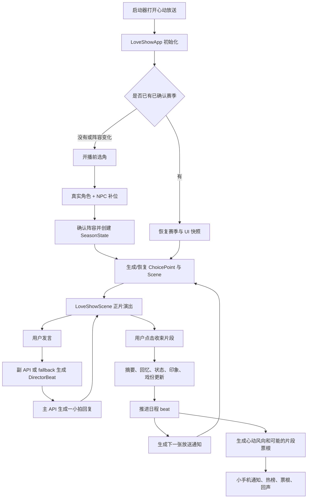

# 心动放送项目概述

更新日期：2026-05-31  
适用范围：前端仓库当前 `LoveShow / 心动放送 / 唯一心动线` 实现。  
面向读者：产品、策划、前端工程师、后续接手开发者。

## 1. 项目定位

`心动放送` 是一个运行在前端里的 AI 恋综系统。它把普通角色聊天包装成一档名为《唯一心动线》的恋爱综艺：用户是本季唯一主角，多位嘉宾围绕用户产生试探、靠近、吃醋、误解、助攻、私聊、单采、热榜和最终选择。

它不是单个角色的线性约会，也不是嘉宾之间互相组 CP 的群像恋综。当前实现的核心是“用户中心向”：所有恋爱张力最终都回到“用户与某位嘉宾”的关系上。嘉宾之间可以竞争、观察、较劲、误解或助攻，但不能互相心动、互选、锁 CP 或脱离用户单开恋爱线。

从工程上看，`心动放送` 是一套前端本地状态机：

- `LoveShowApp` 负责入口、选角、赛季恢复、主状态、AI 调用、小手机、风向、片段剧场和季终页。
- `LoveShowScene` 负责正片场景渲染，把 AI 文本解析成旁白、对白、单采、手机消息等综艺脚本节点。
- `utils/loveshowEngine.ts` 负责赛季状态机、节目日程、选择点、场景生成、导演镜头卡、副模型调用、状态评估、印象卡和 NPC 生成功能。
- `utils/loveshowCast.ts` 负责嘉宾阵容、真实角色锁定、节目组邀请嘉宾补位和角色运行态转换。
- `utils/loveshowWind.ts` 和 `utils/loveshowTheater.ts` 负责心动风向、心动片段票根、回声、热帖和余波。
- `utils/db/loveshowStore.ts` 负责本地持久化。

## 2. 核心原则

### 2.1 用户是唯一恋爱主轴

所有 prompt、状态过滤、热榜、风向、片段票根都围绕用户展开。系统会阻止或兜底处理“嘉宾 CP”“谁和谁最配”“互选心动”“嘉宾恋爱线投票”等方向。

### 2.2 所有嘉宾都是正式嘉宾

角色库角色和节目组邀请 NPC 都会被视为正式嘉宾。镜头焦点只代表这一小拍拍谁更多，不代表其他人是背景板。

### 2.3 正片和镜头之外双层运行

正片是公开录制现场，有导演镜头卡控制谁在场、谁说话、谁只做反应。  
镜头之外是小手机私聊，嘉宾可以对用户暴露更私密的情绪。私聊产生的秘密不会在公开场直接说破，只会转化成停顿、视线、回避、差点露馅等潜台词。

### 2.4 一次只演一小拍

主模型不会被要求一次写完一整天或一整期节目。它每次只演当前一小拍，停在用户能回应的位置。节目推进依赖选择点和收束流程，而不是让模型自由跑远。

### 2.5 副模型做结构化判断，主模型做自然语言演出

主 API 负责“演出来”：生成正片对白、旁白、动作和私聊回复。  
副 API 负责“幕后判断”：生成导演镜头卡、摘要、嘉宾状态、印象卡、NPC、心令、热榜等结构化结果。

### 2.6 本地优先，失败可降级

赛季、嘉宾状态、印象、回忆、热榜、小手机和 UI 快照主要保存在浏览器本地。主 API 失败时，部分开场有硬编码兜底；副 API 缺失或失败时，状态机、NPC、心动风向、社交帖子等都有本地 fallback。

## 3. 关键名词

| 名词 | 含义 |
| --- | --- |
| 心动放送 | 应用名，启动器里的入口。 |
| 唯一心动线 | 节目名，也是当前恋综赛季的包装。 |
| 赛季 | 一次完整恋综运行单元，包含嘉宾阵容、Day 1-5、状态、选择、回忆和终选结果。 |
| 嘉宾 | 本季参与者，来源可以是角色库角色，也可以是节目组邀请 NPC。 |
| 节目组邀请嘉宾 | 当真实角色不足目标人数时生成的 NPC，只在 LoveShow 内部运行，不默认写入角色库。 |
| 放送通知 | 节目组给用户的选择点或流程提示。 |
| 导演镜头卡 | `DirectorBeat`，副模型或本地 fallback 生成的下一小拍调度卡。 |
| 正片 | `LoveShowScene` 中的公开场景演出。 |
| 镜头之外 | 悬浮小手机里的私聊入口。 |
| 隐藏心令 | 用户专属任务，可标记完成。 |
| 心动档案 | 小手机中展示嘉宾状态、好感、印象摘要的栏目。 |
| 心动风向 | 场景收束后生成的观众起哄和下一轮镜头倾向。 |
| 心动热榜 | 微博/小红书式虚拟舆论帖子。 |
| 心动片段 | 风向、任务或通知触发的 solo/triangle 票根系统。 |
| 心动回声 | 心动片段完成后的结果卡，会沉淀为回忆并影响下一场氛围。 |

## 4. 模块地图

| 文件 | 作用 |
| --- | --- |
| `constants.tsx` | 注册 `AppID.LoveShow` 和启动器入口名“心动放送”。 |
| `apps/loveshow/LoveShowApp.tsx` | 主应用，负责选角、赛季初始化、恢复、AI 调用、选择处理、收束、小手机、风向、票根和总结页。 |
| `apps/loveshow/LoveShowScene.tsx` | 正片场景 UI，渲染地点、在场嘉宾、脚本节点、输入框和收束按钮。 |
| `apps/loveshow/loveshow.css` | LoveShow 全部视觉样式。 |
| `types/loveshow.ts` | 赛季、选择点、导演镜头卡、嘉宾状态、印象卡、NPC、场景、心令、风向、片段、回忆等类型定义。 |
| `utils/loveshowEngine.ts` | 核心引擎，包含日程、状态机、选择点、场景生成、导演卡、主副流程的结构化函数。 |
| `utils/loveshowPrompts.ts` | 主模型和副模型 prompt 构造。 |
| `utils/loveshowCast.ts` | 嘉宾选择、目标人数、NPC 兜底、NPC 转运行态角色、选角确认。 |
| `utils/loveshowCopy.ts` | 集中文案命名和禁止 CP 方向短语。 |
| `utils/loveshowScriptParser.ts` | 把 AI 输出解析成旁白、对白、单采、手机消息和普通文本节点。 |
| `utils/loveshowWind.ts` | 生成心动风向，并做用户中心过滤。 |
| `utils/loveshowTheater.ts` | 心动片段票根、嘉宾引用、结果、回声、热帖和余波合并。 |
| `utils/loveshowTheaterLocations.ts` | 心动片段地点池和背景图配置。 |
| `utils/db/loveshowStore.ts` | LoveShow localStorage 读写。 |
| `utils/systemBackup.ts` | 系统备份覆盖 LoveShow localStorage key。 |
| `utils/loveshow*.test.ts` | 当前轻量单元测试覆盖。 |

## 5. 总体架构

这张图可以理解为整个系统的主循环：选角进入赛季，赛季根据日程生成选择点，选择点进入场景，用户和 AI 演一小拍，收束后更新关系状态，再推进到下一个节目节点。

## 6. 入口和初始化

### 6.1 应用入口

`constants.tsx` 注册了 `AppID.LoveShow`，启动器显示为“心动放送”。进入应用后，`LoveShowApp` 从 `useOS()` 读取：

- 当前角色库 `characters`
- 当前活跃角色 `activeCharacterId`
- 用户资料 `userProfile`
- 主 API 配置 `apiConfig`
- 图片生成配置
- toast、打开其他 App、关闭 App 等 OS 能力

当前聊天角色会被视为默认锁定嘉宾。如果角色库里没有可用角色，页面会显示空状态，引导用户去角色库。

### 6.2 是否进入选角页

`LoveShowApp` 初始化时会调用 `getActiveSeason()` 和 `isLoveShowSeasonCastingConfirmed()`。如果没有活跃赛季，或者活跃赛季没有通过当前阵容确认，就打开开播前选角页。

进入选角页的常见原因：

- 第一次打开 LoveShow。
- 用户点击“重新选角开新季”。
- 当前活跃角色不在已有赛季阵容中。
- 用户锁定的真实角色阵容发生变化。
- 本地选角确认 key 丢失。

如果已有赛季能复用，系统会恢复赛季、嘉宾、状态、印象、UI 快照、选择历史、小手机消息、风向和票根。

## 7. 开播前选角机制

### 7.1 嘉宾人数

`utils/loveshowCast.ts` 定义了目标嘉宾人数：

- 最少 4 位。
- 默认 5 位。
- 最多 6 位。

`clampLoveShowGuestCount()` 会把非法值夹到这个范围内。

### 7.2 真实角色选择

`selectLoveShowCharacterGuests()` 会按顺序选择：

1. 当前聊天角色或角色库第一个有效角色。
2. 用户在选角页手动锁定的其他角色。
3. 达到目标人数后停止。

这些真实角色会被转换为 `LoveShowGuest`：

- `source = "user_char"`
- `promoted = true`
- `characterId = 原角色 ID`
- `profileSummary` 来自角色描述和 system prompt
- 初始状态为好感 0、心情“期待”、自信 50、策略“观望”

### 7.3 节目组邀请嘉宾补位

如果真实角色数量少于目标人数，`resolveLoveShowGuestRoster()` 会补齐 NPC。

补位来源优先级：

1. 已有赛季或选角草稿中的 NPC。
2. 如果副 API 可用，调用 `generateNpcSkeletons()` 和 `expandNpcPrompts()` 批量生成 NPC 骨架与完整人设。
3. 如果副 API 不可用或失败，使用 `createFallbackLoveShowNpc()` 的本地预设。

NPC 的核心字段包括：

- `id`
- `name`
- `age`
- `job`
- `memorableDetail`
- `sampleLine`
- `motivation`
- `approach`
- `appearance`
- `generatedPrompt`
- `avatar` 或 `avatarAssetId`

NPC 不会默认写入角色库。系统会用 `loveShowGuestToRuntimeCharacter()` 临时把 NPC 转成 `CharacterProfile` 形态，供正片渲染、prompt 构造和头像展示使用。

### 7.4 选角草稿和确认

选角页第一次点击“生成选角预览”时，会生成 `LoveShowCastingDraft` 并保存到 `loveshow_casting_draft_v2`。用户可以：

- 调整目标嘉宾人数。
- 锁定或取消真实角色。
- 重抽某个空降 NPC。
- 上传 NPC 头像。
- 调用图片生成服务生成 NPC 头像。

点击“确认开播”后：

- 创建或复用 `SeasonState`。
- 保存 NPC 列表。
- 保存选角确认 `loveshow_casting_confirmation_v1`。
- 保存目标嘉宾数。
- 清除选角草稿。
- 进入 Day 1 正片。

## 8. 赛季状态机

### 8.1 SeasonState

`SeasonState` 是恋综运行的硬状态，关键字段如下：

| 字段 | 含义 |
| --- | --- |
| `seasonId` | 本季唯一 ID。 |
| `charIds` | 本季嘉宾 ID，包含真实角色和 NPC。 |
| `targetGuestCount` | 本季目标嘉宾数量。 |
| `day` | 当前天数，当前设计为 Day 1-5。 |
| `phase` | 当前阶段，如 `day_active`、`phone_time`、`observatory`、`day_end`、`finale`、`completed`。 |
| `status` | `running`、`finale` 或 `completed`。 |
| `beatIndex` | 当前 day 内的节目节点下标。 |
| `schedule` | 每天的节目节点列表。 |
| `eliminations` | 已送别嘉宾 ID。 |
| `eliminationOutcomes` | 送别单采结果。 |
| `finalChoice` | 终选结果，允许为 null。 |
| `finaleOutcome` | 终选总结内容。 |
| `screenTime` | 每位嘉宾累计出镜计数，用于平衡镜头。 |
| `startedAt` / `lastActiveAt` | 时间戳。 |

`normalizeSeasonState()` 会补齐旧存档缺失字段，并把 day、beatIndex、targetGuestCount 规整到合法范围。

### 8.2 默认节目日程

当前默认日程在 `DEFAULT_SEASON_SCHEDULE` 中：

| Day | 标题 | 节点 |
| --- | --- | --- |
| 1 | 初见 | opening、group_activity、date、backstage_sms、wind、closing |
| 2 | 升温 | opening、group_activity、interview、date、elimination、wind、closing |
| 3 | 反转 | opening、group_activity、mission、date、elimination、wind、closing |
| 4 | 压力 | opening、observatory、interview、date、elimination、wind、closing |
| 5 | 终选 | opening、date、interview、finale |

每个节点会映射到一个 `SeasonPhase`。例如 `backstage_sms` 和 `wind` 属于 `phone_time`，`observatory` 属于 `observatory`，`elimination` 和 `closing` 属于 `day_end`，`finale` 属于 `finale`。

### 8.3 推进规则

主要推进函数：

- `createSeason()`：创建新赛季，从 Day 1、beatIndex 0 开始。
- `advanceSeasonBeat()`：推进到当天下一个 beat；当天结束后进入下一天；Day 5 之后进入 `completed`。
- `recordSeasonScreenTime()`：场景收束后，把本场在场嘉宾的出镜次数加 1。
- `resolveEliminationChoice()`：处理 Day 2-4 的送别选择。
- `resolveFinaleChoice()`：处理 Day 5 终选并进入季终总结。

当前系统已经有 5 天季播框架、送别和终选能力。实际体验仍比较“即兴片段驱动”，因为很多节目节点的玩法还比较轻量。

## 9. 选择点机制

### 9.1 ChoicePoint 类型

`ChoicePoint` 是节目组给用户的选择点。当前类型包括：

| 类型 | 用途 |
| --- | --- |
| `group_event` | 集体活动或开场集合。 |
| `date_card` | 用户选择把约会卡给谁。 |
| `sms_target` | 用户选择镜头之外短信发给谁。 |
| `sms_content` | 用户输入短信内容。 |
| `daily_mission` | 用户接受或稍后查看隐藏心令。 |
| `interview` | 单采间自由表达。 |
| `observatory` | 观察室查看某位嘉宾独白。 |
| `wind` | 心动风向揭晓。 |
| `elimination` | 用户选择送别谁。 |
| `finale` | Day 5 终选。 |
| `closing` | 今日收束。 |

`generateNextChoicePoint()` 根据当前 day、beatIndex、状态卡和已完成选择历史生成下一张通知。它会把嘉宾选项按 `screenTime` 从少到多排序，从而尽量给低出镜嘉宾更多机会。

### 9.2 哪些选择会开场景

`handleChoiceSubmit()` 中分两类处理：

直接推进类：

- `daily_mission`
- `sms_target`
- `sms_content`
- `wind`
- `closing`
- `elimination`
- `finale`

这类通常不创建新的正式场景，而是更新赛季、任务、送别、终选或通知状态，然后推进到下一 beat。

场景创建类：

- `group_event`
- `date_card`
- `interview`
- `observatory`

这类会调用 `createSceneFromChoice()` 创建 `LoveShowScene`，再调用主 API 生成场景开场。

### 9.3 暂停策略

`shouldPauseForChoice()` 当前规则很简单：除了 `group_event` 外，其他选择点都会暂停并打开小手机通知，让用户先做选择。`group_event` 可以自动继续开场。

## 10. 场景系统

### 10.1 LoveShowScene 数据

一个场景包含：

- `id`
- `dayNumber`
- `locationId`
- `locationName`
- `characterIds`
- `atmosphere`
- `summary`
- `status`

`createSceneFromChoice()` 会根据选择点决定地点和在场嘉宾：

- `group_event` 默认客厅，全员或最多 4 人。
- `date_card` 随机选择外出约会地点，只带被选嘉宾。
- `interview` 进入单采间。
- `observatory` 进入观察室。
- `elimination` 进入告别单采间。
- `finale` 进入终选露台。

普通多人场景由 `selectSceneCharacters()` 按出镜次数平衡选择，最多 4 位。

### 10.2 正片 UI

`LoveShowScene.tsx` 负责展示：

- 直播状态。
- Day 和地点标题。
- 场景氛围。
- 在场嘉宾头像 strip。
- 正片 transcript。
- 错误和重试按钮。
- 收束中状态。
- 用户输入框。
- 发送按钮。
- 收束片段按钮。

它不直接理解复杂业务。它只接收场景、嘉宾、回合、输入、状态和回调。

### 10.3 脚本解析格式

AI 回复会通过 `parseLoveShowScript()` 解析成结构化节点：

| 写法 | 节点类型 | UI 表现 |
| --- | --- | --- |
| `*他低头笑了一下。*` | `narration` | 旁白/动作 |
| `嘉宾名：台词` | `dialogue` | 角色对白 |
| `嘉宾名：「台词」` | `dialogue` | 角色对白并去引号 |
| `📹 嘉宾名：单采内容` | `interview` | 对镜头单采 |
| `（对镜头）嘉宾名：单采内容` | `interview` | 对镜头单采 |
| `📱 内容` | `phone` | 手机消息 |
| 其他文本 | `text` | 普通文本 |

因此主模型不需要输出 JSON。它输出自然剧本格式，前端负责识别和展示。

## 11. 导演镜头卡

### 11.1 为什么需要 DirectorBeat

多人恋综如果只把所有角色人设塞给主模型，模型容易出现几类问题：

- 每位嘉宾都抢着说话。
- 忽略某些嘉宾。
- 一次推进太远。
- 嘉宾之间生成恋爱线。
- 公开场直接说破私聊秘密。
- 用户还没回应，模型替用户做选择。

`DirectorBeat` 是为了解决这些问题。它是一张结构化镜头调度卡，先规定下一小拍的演出边界，再让主模型按卡演出。

### 11.2 DirectorBeat 字段

| 字段 | 含义 |
| --- | --- |
| `beatId` | 镜头卡 ID。 |
| `sceneType` | 场景类型，如 opening_group、group_event、date、phone_time、observatory。 |
| `presentCharIds` | 本小拍实际在场嘉宾。 |
| `cameraFocus` | 镜头焦点列表，包含嘉宾、镜头类型和原因。 |
| `speakers` | 明显发言人，最多 1-3 位。 |
| `reactionOnlyCharIds` | 只能做动作、表情、停顿、视线反应的嘉宾。 |
| `userPosition` | 用户在这一小拍的位置，如被回应、观察、选择、私密时刻。 |
| `endingMode` | 结尾停顿方式，如等用户、继续场景、打开选择、手机通知、场景结束。 |
| `userPromptHint` | 可选，给用户留下的输入空间提示。 |
| `secretSubtextGuestIds` | 有镜头外秘密、需要表现潜台词的嘉宾。 |
| `almostExposedSecretId` | 公私偏离高时，可能差点露馅的秘密 ID。 |
| `directorNote` | 一句话说明这一小拍制造什么张力。 |

### 11.3 生成和校验

`planDirectorBeat()` 会优先使用副 API：

1. 构造 `DirectorBeatInput`，包含赛季、当前场景、嘉宾 brief、最近摘要、最近对话、选择上下文和私聊秘密。
2. 调用 `generateDirectorBeatWithMeta()`。
3. 解析副模型 JSON。
4. 用 `validateDirectorBeat()` 校验。
5. 写入 `directorBeat` 和 debug 信息。

如果副 API 不可用或返回无效结果，使用 `createFallbackDirectorBeat()`。

校验会确保：

- `presentCharIds` 必须是本季有效且当前场景允许的嘉宾。
- 在场嘉宾最多 4 位。
- 发言人最多 3 位。
- 镜头焦点只能给在场嘉宾。
- reactionOnly 不能和 speakers 冲突。
- sceneType、shotType、speaker role、userPosition、endingMode 必须来自允许枚举。
- 私聊秘密只能引用当前在场且确实有秘密的嘉宾。

### 11.4 Fallback 镜头卡

本地 fallback 会：

- 从当前场景或活跃嘉宾中选最多 4 位。
- 优先响应用户刚 cue 到的嘉宾。
- 否则用稳定 hash 轮换 lead。
- 安排第二位嘉宾做回应或反应。
- 如果有人有镜头外秘密，安排潜台词镜头。
- 如果公私偏离高，可能安排一次“差点露馅”的 soft reaction。

这样副 API 不可用时，多人场景仍能稳定运行。

## 12. 主 API 演出机制

### 12.1 主 API 配置

主 API 来自 `useOS()` 的 `apiConfig`，并由 `normalizeApiConfig()` 用 `hasCompleteApiConfig()` 校验。它使用 OpenAI 兼容的 `/chat/completions` 接口。

调用时统一通过 `trackedApiRequest()` 记录到 API 用量账本，feature 为 `love_show`。

### 12.2 正片模式

正片模式的 system prompt 由这些部分组成：

1. `buildMultiCastLoveShowPreamble()`  
   写明用户中心、所有嘉宾正式、不可嘉宾 CP、一次只演一小拍、未安排嘉宾不要抢话等规则。

2. `buildSceneContext()`  
   注入当前地点、氛围、在场嘉宾和最近 3 条摘要。

3. `buildDirectorBeatPerformanceContext()`  
   注入当前导演镜头卡，明确谁在场、谁发言、谁只反应、用户位置、停顿方式和秘密潜台词。

4. 固定短指令  
   要求只演当前小拍，不替用户做选择，不输出系统标签，不解释镜头卡。

用户和 AI 最近最多 14 条 turn 会作为上下文发送。用户 turn 会包装成 `用户名：内容`。

### 12.3 开场生成

进入新场景时，`requestAISceneOpening()` 会：

1. 先规划导演镜头卡。
2. 构造隐藏用户指令 `buildOpeningInstruction()`。
3. 调用主 API。
4. 把返回文本追加到 transcript。

如果主 API 失败，会用 `buildFallbackOpening()` 写一段本地硬编码开场，保证页面不空。

### 12.4 用户发送消息

用户在输入框发言后：

1. `handleSend()` 把用户 turn 追加到 transcript。
2. `requestAssistantReply()` 规划新的导演镜头卡。
3. `callMainApi()` 按正片模式调用主 API。
4. AI 回复追加到 transcript。
5. UI 解析并显示为脚本节点。

失败时会显示错误并允许重试。

## 13. 镜头之外小手机

### 13.1 小手机是什么

小手机是 LoveShow 的幕后中枢。它是一个可拖拽浮层，入口在右下角，打开后有 5 个 tab：

| Tab | 作用 |
| --- | --- |
| 镜头之外 | 和单个嘉宾私聊。 |
| 放送通知 | 查看当前选择点并提交选择。 |
| 隐藏心令 | 查看和标记任务。 |
| 心动档案 | 查看嘉宾好感、心情和印象摘要。 |
| 心动热榜 | 查看心动风向和虚拟社交帖子。 |

小手机支持：

- 未读红点。
- 每个 tab 独立未读状态。
- 拖拽位置。
- 自定义壁纸上传。
- 恢复默认壁纸。

壁纸原图保存在 IndexedDB asset 中，模式保存在 localStorage。

### 13.2 私聊模式

用户在“镜头之外”给某位嘉宾发消息后：

1. 追加用户手机消息。
2. 构造 phone 模式的 `LoveShowTurn`。
3. 调用 `callMainApi()`，mode 为 `phone`。
4. 主模型只扮演当前私聊嘉宾，回复 1-2 句。
5. 用 `cleanPhoneReply()` 去掉动作、角色名前缀和外层引号。
6. 追加嘉宾手机消息。

phone 模式 system prompt 与正片不同：

- 使用 `buildParallelLoveShowCoreContext()`，说明这是恋综平行世界，不默认继承原聊天关系进展。
- 使用单嘉宾 `buildLoveShowPreamble()`。
- 使用 `buildPrivateChatSecretInstruction()` 注入已有私聊秘密和状态。
- 明确只回复镜头之外私聊，不要替用户做选择。

### 13.3 私聊秘密机制

私聊回复后，系统会调用 `evaluateLoveShowPrivateSecretWithMeta()` 判断这次私聊是否形成“镜头外秘密”。本地和副模型都会过滤风险方向。

可形成秘密的典型信号：

- 喜欢、心动、偏心。
- 只告诉你、别告诉别人。
- 不想让别人知道。
- 示弱、害怕、请求。
- 把柄、秘密、承认。

如果形成秘密：

1. 写入 `privateSecrets`。
2. 用 `mergePrivateSecretIntoGuestState()` 合入该嘉宾状态。
3. 更新 `publicPosture`、`privateTruth`、`publicPrivateDivergence` 等公私差异字段。
4. 后续公开场的 DirectorBeat 会通过 `privateSecretsForPublicScene()` 把秘密作为潜台词输入。

公开场不会让嘉宾复述私聊内容，而是表现为回避、停顿、差点说漏或只让用户读懂的反应。

## 14. 场景收束和关系更新

用户点击“收束片段”后，`handleCompleteScene()` 执行完整幕后结算。

### 14.1 收束流程

1. 整理 transcript 为原始对话文本。
2. 如果副 API 可用，调用 `generateSceneSummary()` 生成 20-30 字摘要；否则使用本地摘要。
3. 保存 `MemoryCard`。
4. 遍历本场在场嘉宾。
5. 根据导演镜头卡计算更新强度：
   - speakers 为 strong。
   - cameraFocus 为 medium。
   - 只在场但没焦点为 weak。
6. strong/medium 且副 API 可用时：
   - 调用 `evaluateCharacterState()` 更新嘉宾状态。
   - 调用 `updateImpression()` 更新嘉宾对用户的印象卡。
7. weak 或副 API 不可用时：
   - 本地小幅增加好感。
   - 必要时把心情设为“心动”。
   - 写入本地 innerThought fallback。
8. 保存状态卡和印象卡。
9. 记录本场嘉宾出镜次数。
10. 推进赛季 beat。
11. 生成下一张放送通知。
12. 生成心动风向。
13. 可能生成心动片段票根。
14. 清空当前 transcript，进入下一场或等待用户选择。

### 14.2 CharacterState

嘉宾状态卡字段：

| 字段 | 含义 |
| --- | --- |
| `affection` | 好感度，0-100。 |
| `mood` | 心情：期待、吃醋、受伤、心动、试探、冷淡、紧张、开心。 |
| `confidence` | 自信度，0-100。 |
| `strategy` | 策略：主动进攻、欲擒故纵、默默守护、直球表白、观望、撤退。 |
| `jealousyTarget` | 嫉妒对象。 |
| `innerThought` | 当前内心想法。 |
| `publicPosture` | 镜头前姿态和策略面具。 |
| `privateTruth` | 镜头外真心。 |
| `publicPrivateDivergence` | 公私偏离度，越高越容易公开场差点露馅。 |
| `lastUpdatedScene` | 最近更新来源。 |

### 14.3 ImpressionCard

印象卡记录“某位嘉宾眼里的用户”，不是上帝视角用户画像。字段：

- `perceivedTraits`
- `knownFacts`
- `tentativeReads`
- `impression`
- `history`

`updateImpression()` 对内容有严格安全约束，避免把用户写成猎物、奖品、危险变量、被攻略对象或被审判对象。如果副模型输出不安全，会尝试修正；修正仍不安全则用本地 fallback。

## 15. 心动风向和热榜

### 15.1 心动风向

场景收束后，`createLoveShowWindItems()` 会基于嘉宾、用户、day、场景摘要和首个镜头焦点生成风向项。

当前风向类型包括：

- `solo_date`
- `most_obvious`
- `jealous_hint`
- `famous_scene`
- `tomorrow_lens`
- `message_prompt`

实际当前本地生成主要会产出：

- 观众正在起哄。
- 风向揭晓。
- 最像心动名场面的瞬间。
- 明日镜头倾向。

`isUserCenteredLoveShowWindItem()` 会过滤掉不围绕用户或带嘉宾 CP 风险的文本。

### 15.2 心动热榜

热榜帖子来源两类：

1. 用户点击小手机热榜刷新时，副 API 调用 `generateSocialPosts()`，生成微博/小红书式观众反应。
2. 副 API 不可用或失败时，使用 `createFallbackSocialPosts()`。

生成后保存到 `loveshow_social_${seasonId}_day${day}`，并给 `buzz` tab 标未读。

热榜同样要求围绕“用户 × 嘉宾”关系，不允许生成“嘉宾 × 嘉宾”恋爱主线。

## 16. 心动片段剧场

### 16.1 票根生成

场景收束后，如果当天还没有发过片段票根，且心动风向存在，系统可能调用 `createLoveShowTheaterTicket()` 生成票根。

票根字段包括：

- `id`
- `seasonId`
- `day`
- `episodeDayId`
- `mode`
- `source`
- `title`
- `description`
- `suggestedGuestIds`
- `suggestedGuestRefs`
- `requiredGuestCount`
- `suggestedLocationId`
- `effectHint`

当前模式：

- `solo`：需要 1 位嘉宾。
- `triangle`：需要 2 位嘉宾。

是否尝试 triangle 当前是轻量规则：如果风向涉及至少两位嘉宾，并且已完成选择数满足一定节奏，就可能生成三人片段。

### 16.2 片段地点

`loveshowTheaterLocations.ts` 提供预设地点池，每个地点有：

- 中文名和英文名。
- 描述。
- 标签。
- 背景图路径。
- 渐变兜底。

当前地点包括信号露台、夜灯便利店、单采间门外、玻璃花房、小屋中岛台、天台晾衣区、蓝光水族馆、街机角落、旧书店橱窗、雨棚车站、心动照片墙、清晨栈桥、练歌房后台、放映小厅、补妆镜前等。

### 16.3 片段完成

当前片段剧场还不是独立可多轮对话的小剧场。用户在票根卡上选择嘉宾和地点后：

1. 点击开始，进入 `activeTheaterTicket` 状态。
2. 点击完成，调用 `createLoveShowTheaterResult()` 生成结果。
3. 调用 `createLoveShowTheaterEcho()` 生成心动回声。
4. 保存回忆卡。
5. 追加一条片段热帖。
6. 把 `effectHint` 合并到下一场氛围中。
7. 标记热榜未读。

这套机制已经能完成“票根 - 结果 - 回声 - 回忆 - 热帖 - 余波”的闭环，但片段内部还不是完整演出空间。

## 17. 送别和终选

### 17.1 送别

Day 2-4 的 `elimination` 节点会根据 `shouldRunElimination()` 判断是否真的送别。

当前规则：

- Day 1 不送别。
- Day 5 不送别。
- Day 2 如果总嘉宾数不超过 4，跳过送别。
- 嘉宾较多时，目标决赛人数为 2 或 3。
- 只有活跃嘉宾数超过目标决赛人数才送别。

送别时，`resolveEliminationChoice()` 会：

- 把嘉宾 ID 加入 `eliminations`。
- 生成 `EliminationOutcome`。
- 写一段体面告别单采。
- 推进到下一 beat。
- 保存一张回忆卡。

### 17.2 终选

Day 5 的 `finale` 节点会给出所有仍在场嘉宾，以及一个“ 不选择任何人 ”开放式结局选项。

`resolveFinaleChoice()` 会：

- 写入 `finalChoice`。
- 生成 `FinaleOutcome`。
- 若选择某位嘉宾，生成被选嘉宾回应。
- 为未被选嘉宾生成单采。
- 若开放式结局，生成“把选择权收回自己手中”的收束说明。
- 把赛季置为 `completed`。

完成后 UI 会显示季终回顾页，包括：

- 终选结果。
- 被选嘉宾回应。
- 未被选嘉宾单采。
- 送别记录。
- 心动曲线。
- 本季名场面。
- 重新选角开新季入口。

## 18. 本地持久化

### 18.1 localStorage key

`utils/db/loveshowStore.ts` 使用以下 key：

| Key | 内容 |
| --- | --- |
| `loveshow_season_${seasonId}` | `SeasonState`。 |
| `loveshow_charstate_${seasonId}_${charId}` | 单个嘉宾状态卡。 |
| `loveshow_impression_${seasonId}_${charId}` | 单个嘉宾对用户的印象卡。 |
| `loveshow_npcs_${seasonId}` | 本季 NPC 列表。 |
| `loveshow_active_season` | 当前活跃赛季 ID。 |
| `loveshow_social_${seasonId}_day${day}` | 某天热榜帖子。 |
| `loveshow_missions_${seasonId}` | 隐藏心令列表。 |
| `loveshow_memories_${seasonId}` | 回忆卡列表。 |
| `loveshow_season_index` | 赛季索引。 |
| `loveshow_casting_draft_v2` | 当前选角草稿。 |

`LoveShowApp.tsx` 还使用：

| Key | 内容 |
| --- | --- |
| `loveshow_ui_${seasonId}` | UI 快照，包含 choice、scene、transcript、小手机、风向、票根等。 |
| `loveshow_choice_history_${seasonId}` | 已完成选择点历史。 |
| `loveshow_phone_wallpaper_mode` | 小手机壁纸模式。 |
| `loveshow_locked_guest_ids_v1` | 用户锁定的真实角色 ID。 |
| `loveshow_casting_confirmation_v1` | 已确认赛季阵容。 |
| `loveshow_target_guest_count_v1` | 目标嘉宾数。 |

### 18.2 IndexedDB asset

大图不适合直接塞 localStorage。当前通过 `DB.saveAsset()` 保存：

- 小手机自定义壁纸，assetId 为 `loveshow_phone_wallpaper_original`。
- NPC 头像，assetId 前缀为 `loveshow_guest_avatar_`。

`hydrateNpcAvatars()` 会在读 NPC 草稿或赛季 NPC 时，把 asset 中的头像补回到运行态。

### 18.3 系统备份

`utils/systemBackup.ts` 已把 LoveShow 固定 key 和前缀 key 纳入系统备份范围，包括赛季、状态、印象、NPC、热榜、任务、回忆、UI 快照和选择历史。

## 19. API 分工和调用记录

### 19.1 主 API

用途：

- 正片小拍生成。
- 新场景开场。
- 镜头之外私聊。

配置来源：全局主 API 设置。  
请求方式：OpenAI 兼容 `/chat/completions`。  
账本 feature：`love_show`。  
用户主动性：私聊为 `userInitiated: true`，正片生成为 `false`。

### 19.2 副 API

用途：

- DirectorBeat。
- 私聊秘密判定。
- 场景摘要。
- 嘉宾状态评估。
- 印象卡更新和修复。
- 热榜帖子。
- NPC 骨架生成。
- NPC 人设展开。
- 隐藏心令。

配置来源：`selectSecondaryApiConfig()`。  
请求方式：OpenAI 兼容 `/chat/completions`。  
账本 feature：`love_show`。  
超时：60 秒。  
最大 token：当前设置较高，用于 NPC 批量生成和结构化输出。

### 19.3 降级策略

| 场景 | 降级 |
| --- | --- |
| 副 API 不可用 | DirectorBeat 用本地 fallback。 |
| 主 API 开场失败 | 用 `buildFallbackOpening()`。 |
| 场景摘要失败 | 用本地默认摘要。 |
| 状态评估不可用 | 本地小幅好感和心情更新。 |
| 印象卡不安全 | 尝试副模型修复，失败后本地安全 fallback。 |
| NPC 生成失败 | 使用本地 NPC 预设。 |
| 热榜生成失败 | 使用本地热榜 fallback。 |
| 心令生成失败 | 使用本地心令 fallback。 |

## 20. 安全和方向控制

LoveShow 当前在多个层级控制方向。

### 20.1 Prompt 规则

主模型 prompt 明确：

- 用户是恋爱主轴。
- 嘉宾之间不能发展成恋爱主线。
- 不替用户做选择。
- 未安排嘉宾不能大段发言。
- 私聊秘密公开场不能说破。
- 一次只演当前小拍。

副模型 prompt 明确：

- 热榜、NPC、心令、风向都必须围绕用户。
- 禁止嘉宾互选、互相心动、嘉宾 CP。
- 印象卡不能审判、攻略、物化用户。

### 20.2 正则过滤和 fallback

模块内有多组风险表达过滤：

- `PRIVATE_SECRET_CP_RISK_RE`
- `GUEST_GUEST_CP_RISK_RE`
- `CP_RISK_RE`
- `THEATER_CP_RISK_RE`
- `IMPRESSION_RISK_TERMS`

这些过滤会阻止或替换：

- 谁和谁最配。
- 嘉宾 CP 榜。
- 互选心动。
- 锁死。
- 恋爱线投票。
- 出局/失败者/决定你爱谁。
- 猎物、奖品、战利品、征服、驯服、攻略、占有等印象卡风险措辞。

## 21. 典型完整流程

下面用一次正常体验串起来说明系统如何运作。

### 21.1 第一次进入

1. 用户从桌面打开“心动放送”。
2. `LoveShowApp` 读取角色库和当前角色。
3. 没有已确认赛季，进入选角页。
4. 当前聊天角色默认锁定。
5. 用户选择本季 5 位嘉宾。
6. 真实角色不足，系统调用副 API 生成 NPC；失败则用本地预设。
7. 用户确认开播。
8. 创建 `SeasonState`，保存 active season、NPC、选角确认和目标人数。

### 21.2 Day 1 开场

1. `generateNextChoicePoint()` 生成 Day 1 opening 的 `group_event`。
2. 因为 group_event 可以自动开场，系统创建客厅场景。
3. `planDirectorBeat()` 生成导演镜头卡。
4. 主 API 根据多人 preamble、场景上下文、镜头卡写 3-6 句开场。
5. UI 解析成旁白和对白。
6. 用户输入回应。
7. 系统再次生成导演镜头卡。
8. 主 API 生成下一小拍。

### 21.3 用户私聊

1. 用户打开小手机，进入“镜头之外”。
2. 选择某位嘉宾发送私聊。
3. 主 API 以 phone 模式生成该嘉宾 1-2 句回复。
4. 副 API 或本地判断这是否形成私聊秘密。
5. 如果形成秘密，写入 `privateSecrets` 并合入嘉宾状态。
6. 后续公开场会绕着这个秘密演潜台词。

### 21.4 收束片段

1. 用户点击正片输入栏旁的“收束”。
2. 副 API 生成摘要。
3. 保存回忆卡。
4. 对本场在场嘉宾逐个更新状态和印象。
5. 记录出镜次数。
6. 赛季推进到下一 beat。
7. 生成下一张放送通知。
8. 生成心动风向。
9. 可能生成心动片段票根。
10. 小手机出现通知和热榜未读。

### 21.5 约会卡

1. 小手机显示 `date_card`。
2. 用户选择一位嘉宾。
3. 系统创建外出约会场景，地点从 `DATE_LOCATION_POOL` 随机选。
4. 该场景只带被选嘉宾。
5. 主 API 写约会开场。
6. 用户继续互动并最终收束。

### 21.6 终选

1. Day 5 进入 finale。
2. 用户选择一位决赛嘉宾，或选择开放式结局。
3. 系统生成终选结果、被选回应、未被选单采。
4. 保存相关回忆卡。
5. 赛季状态置为 completed。
6. 页面显示季终回顾。

## 22. 当前测试覆盖

当前已有轻量测试覆盖：

| 测试文件 | 覆盖内容 |
| --- | --- |
| `utils/loveshowCast.test.ts` | 真实角色选择、NPC 补位、目标人数、选角确认、用户中心文案约束。 |
| `utils/loveshowEngine.test.ts` | 赛季状态机、导演卡校验、NPC 解析、印象卡修复等核心引擎行为。 |
| `utils/loveshowWind.test.ts` | 风向生成、用户中心过滤、避免嘉宾 CP。 |
| `utils/loveshowTheater.test.ts` | 票根、solo/triangle 校验、地点、回声、热帖、余波、同日去重和风险过滤。 |
| `test/systemBackupCoverage.test.ts` | LoveShow localStorage key 纳入系统备份。 |
| `test/photoGeneration.test.ts` | LoveShow 相关图片风格 preset 覆盖。 |

当前未看到完整的 LoveShow UI E2E 或组件级交互测试。小手机拖拽、选角页、正片输入、收束、季终页等仍主要依赖人工浏览器走查。

## 23. 当前能力边界

### 23.1 已经具备的闭环

当前实现已经能完成：

- 入口注册。
- 开播前选角。
- 真实角色锁定。
- NPC 补位和重抽。
- NPC 头像上传/生成。
- 赛季创建、复用、确认。
- Day 1-5 日程状态机。
- 放送通知。
- 多嘉宾正片演出。
- 导演镜头卡。
- 镜头之外私聊。
- 私聊秘密和公开场潜台词。
- 场景收束。
- 回忆卡。
- 状态卡和印象卡。
- 心动风向。
- 心动热榜。
- 心动片段票根、结果、回声和热帖。
- 送别。
- 终选。
- 季终回顾。
- 本地持久化和备份覆盖。

### 23.2 仍偏轻量的部分

当前仍需注意：

- 片段剧场不是独立可多轮对话空间，当前更像结果卡和余波系统。
- 观察室和单采还没有完全做成强栏目。
- 送别和终选已有状态闭环，但文本大多是本地模板，还没有完整节目级演出。
- 约会卡外出地点已由节目组统一安排，合宿屋地点不再作为独立用户选择点。
- 心动风向主要是本地生成，副 API 只负责热榜帖子。
- UI 复杂度较高，但缺少完整移动端 E2E 覆盖。
- NPC 不会自动转正为角色库角色，也没有独立长期记忆中心。

## 24. 后续开发的推荐读法

如果要接手 LoveShow，建议按这个顺序读代码：

1. `types/loveshow.ts`  
   先理解所有核心数据结构。

2. `utils/loveshowEngine.ts`  
   读 `DEFAULT_SEASON_SCHEDULE`、`generateNextChoicePoint()`、`createSceneFromChoice()`、`createFallbackDirectorBeat()`、`validateDirectorBeat()`、副模型调用函数。

3. `utils/loveshowCast.ts`  
   理解真实角色和 NPC 如何组成一季阵容。

4. `apps/loveshow/LoveShowApp.tsx`  
   按初始化 useEffect、`callMainApi()`、`planDirectorBeat()`、`handleChoiceSubmit()`、`handleCompleteScene()`、小手机私聊、选角页、片段剧场的顺序读。

5. `apps/loveshow/LoveShowScene.tsx` 和 `utils/loveshowScriptParser.ts`  
   理解 AI 文本如何变成页面上的正片节点。

6. `utils/loveshowWind.ts`、`utils/loveshowTheater.ts`、`utils/loveshowTheaterLocations.ts`  
   理解收束后的风向、票根、回声和余波。

7. `utils/db/loveshowStore.ts` 和 `utils/systemBackup.ts`  
   理解保存、恢复和备份范围。

## 25. 修改时最容易踩的点

- 不要绕过 `normalizeSeasonState()` 直接相信旧存档字段完整。
- 新增 ChoiceType 后，要同步类型、`generateNextChoicePoint()`、`handleChoiceSubmit()`、`createSceneFromChoice()`、UI 展示和测试。
- 修改 DirectorBeat 结构要很慎重，它是副模型和主模型之间的合同。
- 不要让主模型一次推进太多剧情，否则用户选择权会被模型吞掉。
- 私聊秘密只能属于“某嘉宾与用户”，不要让秘密变成嘉宾之间的恋爱线。
- 热榜、风向、片段和心令都要过用户中心检查。
- NPC 头像和壁纸这类大图应走 IndexedDB asset，不要直接长期塞 localStorage。
- 场景收束会触发多个副作用，改动前要看清楚回忆、状态、印象、beat 推进、风向、票根和 UI 快照之间的顺序。
- 重新选角会清除选角确认并强制新赛季，不要误复用旧阵容。
- `screenTime` 会影响后续嘉宾排序，手动改 `charIds` 时要同步初始化或归一化。

## 26. 一句话总结

`心动放送` 当前是一套“用户中心向 AI 恋综状态机”：它用选角系统组成本季嘉宾，用 Day 1-5 日程生成节目组选择点，用 DirectorBeat 控制多人镜头，用主 API 演正片和私聊，用副 API 做摘要、状态、印象和幕后判断，再用小手机、风向、热榜、票根和回忆把每段互动沉淀成一季节目的连续体验。
